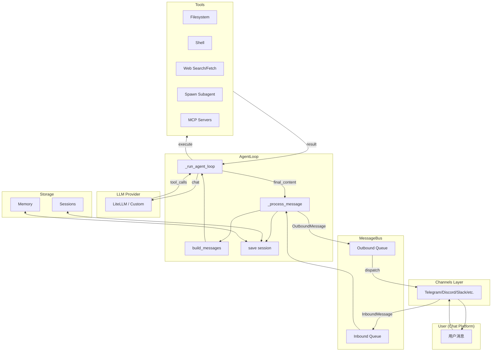

# CLAUDE.md

This file provides guidance to Claude Code (claude.ai/code) when working with code in this repository.

## Quick Start

**Setup with uv** (recommended):

```bash
# Create virtual environment
uv venv

# Activate it
# Windows:
.venv\Scripts\activate
# Unix/macOS:
source .venv/bin/activate

# Install with dev dependencies
uv pip install -e ".[dev]"
```

**Alternative with pip**:

```bash
pip install -e ".[dev]"
```

**Run tests**:

```bash
# All tests
pytest

# Single test file
pytest tests/test_cli_input.py

# With coverage
pytest --cov=nanobot
```

**CLI commands**:

```bash
# Show help
nanobot --help

# Initialize config
nanobot onboard

# Chat with agent
nanobot agent -m "Hello!"

# Interactive chat
nanobot agent

# Start gateway (for channels)
nanobot gateway
```

## Architecture Overview

**Core Flow**: Channels → MessageBus → AgentLoop → LLMProvider → Tools

### Message Flow Diagram



### Preprocessor (消息分析器)

The message analyzer (`nanobot/preprocessor/analyzer.py`) provides message preprocessing with subjective/objective analysis, bias detection, and entropy calculation.

**Architecture**:
- Uses Anthropic SDK or OpenAI SDK directly (bypasses LiteLLM)
- 3 LLM calls: Analysis → Review → Report Generation
- Supports both Anthropic and OpenAI-compatible endpoints (e.g., Zhipu Coding Plan)

**Usage**:
```python
from nanobot.preprocessor.analyzer import MessageAnalyzer, analyze_message

# Create analyzer with Zhipu Coding Plan
analyzer = MessageAnalyzer(
    provider=provider,
    model="glm-5",
    temperature=0.3,
    api_key="your-api-key",
    api_base="https://open.bigmodel.cn/api/coding/paas/v4",
    client_type="openai",  # or "anthropic"
)

# Analyze a message
result = await analyze_message(
    message="用户消息内容",
    analyzer=analyzer,
    num_iterations=1,  # Number of review iterations
)

# Results include:
# - subjective_ratio: 主观比例 (0.0-1.0)
# - objective_ratio: 客观比例 (0.0-1.0)
# - confidence_score: 事实置信度 (0.0-1.0)
# - bias_score: 偏见评分 (0.0-1.0)
# - bias_types: 偏见类型列表
# - entropy: 熵值 (不确定性度量)
# - confidence_level: high/medium/low
# - report: 分析报告文本
```

**Test Command**:
```bash
# Run the analyzer test
uv run python test_analyzer.py
```

### Directory Structure

```
nanobot/
├── agent/          # Core agent loop, memory, tools
│   ├── loop.py     # Main processing: receives messages, calls LLM, executes tools
│   ├── context.py  # Prompt builder with history/memory/skills
│   ├── memory.py   # Persistent memory consolidation
│   ├── subagent.py # Background task execution
│   └── tools/      # Built-in tools (filesystem, shell, web, spawn, mcp)
├── channels/       # Chat platforms (Telegram, Discord, Slack, etc.)
├── bus/            # Message routing (inbound/outbound queues)
├── providers/      # LLM providers via LiteLLM
│   ├── registry.py # ProviderSpec definitions - single source of truth
│   ├── litellm_provider.py
│   └── custom_provider.py  # Direct OpenAI-compatible endpoint
├── config/         # Pydantic-based configuration
├── session/        # Conversation session management
├── cron/           # Scheduled tasks
└── cli/            # Typer-based commands
```

## Key Patterns

**Provider Registry** (`providers/registry.py`): Adding a new LLM provider requires only 2 steps:
1. Add `ProviderSpec` to `PROVIDERS` tuple
2. Add field to `ProvidersConfig` in `config/schema.py`

The registry drives environment setup, model prefixing, and `nanobot status` display automatically.

**Tool Registry** (`agent/tools/registry.py`): Tools are registered with the agent loop. Built-in tools include:
- Filesystem: ReadFile, WriteFile, EditFile, ListDir
- ExecTool: Shell command execution with timeout/safety
- WebSearch/WebFetch: Brave Search + web scraping
- SpawnTool: Launch subagents for background tasks
- MCP: Model Context Protocol for external tool servers

**Message Bus** (`bus/queue.py`): AsyncIO-based pub/sub for routing messages between channels and the agent loop.

**Channel Manager** (`channels/manager.py`): Starts/stops all enabled channels. Each channel implements `BaseChannel` with `start()`, `stop()`, `send()` methods.

## Configuration

Config file: `~/.nanobot/config.json`

**Test configuration** (using Anthropic-compatible endpoint):

```json
{
  "agents": {
    "defaults": {
      "model": "qwen3.5-plus",
      "workspace": "~/.nanobot/workspace"
    }
  },
  "providers": {
    "anthropic": {
      "apiKey": "sk-sp-xxx",
      "apiBase": "https://coding.dashscope.aliyuncs.com/apps/anthropic"
    }
  }
}
```

## Development Notes

- Python 3.11+
- Uses `loguru` for logging
- LiteLLM for multi-provider LLM access
- Pydantic v2 for config validation
- ruff for linting (`ruff check .`)

## Testing

```bash
# All tests
pytest

# Single test file
pytest tests/test_cli_input.py

# With coverage
pytest --cov=nanobot
```
